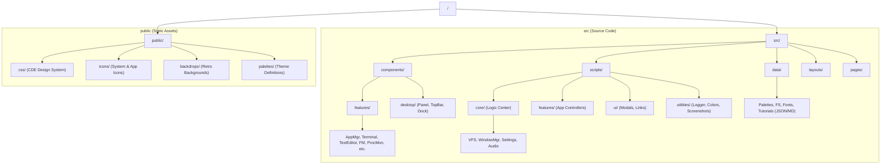
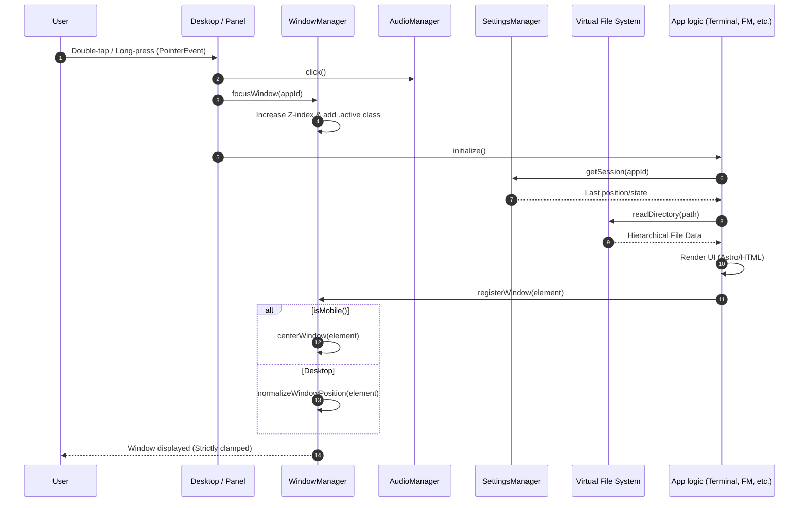

# 📟 Contributing to Debian-CDE

First off, thank you for considering contributing to Debian-CDE! It's people like you that make this nostalgic journey possible.

## 🛠️ Development Setup

This project is built with **Astro**, **TypeScript**, and **Vanilla CSS**.

### Prerequisites

- **Node.js**: v20 or higher
- **npm**: v10 or higher

### Getting Started

1. **Fork** the repository and clone it to your local machine.
2. **Install dependencies**:
   ```bash
   npm install
   ```
3. **Run the development server**:
   ```bash
   npm run dev
   ```
4. Open your browser at `http://localhost:4321` to see the desktop in action.

> [!IMPORTANT]
> **Never commit the `node_modules` folder.** The project includes a `.gitignore` that handles this, but please ensure your local environment respects it. All dependencies should be managed via `package.json`.

## 🏗️ Project Architecture

To understand how the pieces fit together, here is a high-level overview of the project structure and how components communicate.

### Project Structure Map



### Component Interaction Flow

The following diagram illustrates what happens when a user interacts with a desktop element:



## 📂 Detailed Folder Breakdown

- `src/components/`: Astro components for UI parts (Dock, Windows, Panel).
- `src/scripts/core/`: Essential systems like the Virtual Filesystem (VFS) and Global Config.
- `src/scripts/features/`: Specialized modules (FileManager, Terminal, StyleManager).
- `src/data/`: JSON assets for palettes, backdrops, and filesystem structure.
- `public/css/`: Modular CSS files following the CDE design tokens.

## 🚀 Continuous Integration (CI)

We use **GitHub Actions** to ensure stability:

- **Automatic Deployment**: Every push to `main` triggers a build and deployment to [debian.com.mx](https://debian.com.mx).
- **Build Verification**: We recommend running `npm run build` locally before pushing to catch any TypeScript or Astro errors.

## 📜 Contribution Guidelines

1. **Bug Fixes**: Open an issue first, then submit a PR referencing the issue.
2. **New Features**: Please propose new features in the "Discussions" or "Issues" tab before implementation.
3. **Styling**: Stick to the original CDE color palettes found in `src/data/cde_palettes.json`. Use the `colorutils.ts` for any dynamic shading needs.
4. **Code Quality**: Ensure your code is properly typed with TypeScript.
5. **Formatting**: Before committing, run the formatter to keep the code clean:
   ```bash
   npm run format
   ```
6. **Local Build**: Always run `npm run build` before pushing to ensure there are no TypeScript or Astro errors.

## 🧪 Testing your changes

1. Run the formatter: `npm run format`
2. Run the build: `npm run build`

If the build succeeds, it means most of the component logic and types are correct. Pull Requests that fail the build will not be merged.

---

_“Built with passion for the pixel.”_
