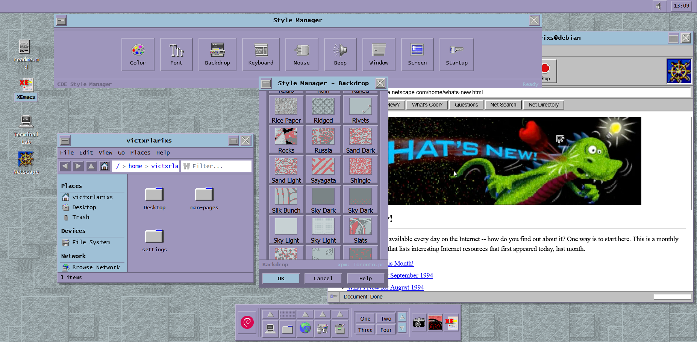

# 📟 CDE Time Capsule

> **Ever wonder what it felt like to sit in front of a $20,000 Unix workstation in 1996?**

Welcome to a pixel-perfect recreation of the Common Desktop Environment (CDE)—living right inside your modern browser. This isn't just a website; it's a living desktop where you're not a "visitor," you're a **user** of a classic Unix system.

  

## 🚀 [Experience It Now →](https://debian.com.mx)

## No installation. No setup. Just pure 1990s Unix nostalgia.

## ✨ What Makes This Special

| Feature                    | Experience                                                                                                     | Learn More                                                |
| -------------------------- | -------------------------------------------------------------------------------------------------------------- | --------------------------------------------------------- |
| **76 Color Palettes**      | From iconic **Platinum** to warm **Broica**—authentic Motif themes that transform your entire desktop          | [Style Manager Guide →](docs/user-guide/style-manager.md) |
| **168 Original Backdrops** | Dithered XPM textures from the 90s. **CircuitBoards**, **BrokenIce**, **Afternoon**—pure computing history     | [Style Manager Guide →](docs/user-guide/style-manager.md) |
| **XEmacs Editor**          | Real Emacs keybindings (`C-x C-s`, `M-x`, `C-k`), interactive minibuffer, GNU splash screen. It feels **real** | [XEmacs Guide →](docs/user-guide/xemacs.md)               |
| **Terminal Lab**           | 41 interactive lessons. Watch commands type themselves. Learn Unix by doing—from `ls` to pipes                 | [Terminal Lab Guide →](docs/user-guide/terminal-lab.md)   |
| **Virtual Filesystem**     | Create files, make directories, navigate with context menus. A real filesystem in your browser                 | [File Manager Guide →](docs/user-guide/file-manager.md)   |
| **Netscape Navigator**     | Web browsing from 1994. Animated logo. That nostalgic "Loading..." message                                     | [Netscape Guide →](docs/user-guide/netscape.md)           |
| **Lynx Browser**           | Text-based web browser from 1992. Keyboard-driven navigation. Pure terminal browsing experience                | [Lynx Guide →](docs/user-guide/lynx.md)                   |
| **4 Virtual Workspaces**   | Just like real CDE. Organize across four desktops. Switch with `Ctrl+Alt+1-4`                                  | [Workspaces Guide →](docs/user-guide/workspaces.md)       |
| **Authentic Updates**      | Version updates show real Debian package manager sequences. Watch `apt-get` download and install packages      | [Technical Docs →](docs/technical/version-updates.md)     |

---

## 🎯 The Experience

| Feature                | What You Feel                                                   |
| ---------------------- | --------------------------------------------------------------- |
| **Boot Sequence**      | Watch the system initialize, just like a real Unix workstation  |
| **System Updates**     | Authentic apt-get package updates.                              |
| **Window Dragging**    | Smooth, authentic window management with title bars and borders |
| **Style Manager**      | Total control—change everything from colors to mouse behavior   |
| **Context Menus**      | Right-click anywhere. Real menus, real actions                  |
| **Keyboard Shortcuts** | 20+ shortcuts. Navigate like a power user                       |
| **Sound Synthesis**    | Authentic system beeps via Web Audio API                        |
| **PWA Support**        | Install it. Use it offline. It's your desktop now               |

---

## 📱 Works Everywhere

**Desktop, tablet, phone**—the experience adapts. Touch gestures on mobile. Keyboard shortcuts on desktop. Always authentic.

- **Double-tap** to open
- **Long-press** for context menus
- **Pinch to zoom** (disabled for authenticity)
- **Landscape mode** for full immersion

---

## Try These First

1. **Open Style Manager** → Try the "Broica" palette with "CircuitBoards" backdrop
2. **Launch XEmacs** → Type something, save with `Ctrl+X Ctrl+S`
3. **Start Terminal Lab** → Complete lesson 1, watch the magic
4. **Switch Workspaces** → Press `Ctrl+Alt+2`, open different apps
5. **Explore File Manager** → Right-click, create folders, organize

---

## Stack

- **Astro** - Islands architecture for optimal performance
- **TypeScript** - Type-safe, maintainable code
- **Vanilla CSS** - No frameworks, pure performance
- **Web Workers** - Non-blocking operations
- **IndexedDB** - Persistent storage
- **Service Workers** - Offline capability

---

## 📚 Documentation

**New User?** Start here: **[Getting Started Guide →](docs/user-guide/getting-started.md)**

**Power User?** Check out: **[Keyboard Shortcuts →](docs/user-guide/keyboard-shortcuts.md)** | **[Tips & Tricks →](docs/user-guide/tips-and-tricks.md)**

**Developer?** Read: **[Architecture →](docs/technical/architecture.md)** | **[Contributing →](CONTRIBUTING.md)**

**[📖 Full Documentation →](docs/README.md)**

---

## 🤝 Contributing

Love nostalgia? Love code? **We'd love your help!**

- Add new color palettes
- Create backdrops
- Improve accessibility
- Fix bugs
- Write documentation

**[Read the Contributing Guide →](CONTRIBUTING.md)**

---

## 📜 License

GPL License - see [LICENSE](LICENSE)

---

  <b>Built for performance. Crafted for nostalgia. Engineered for the pixel.</b> 
   
  

  <i>Not just a recreation. A time machine.</i>

